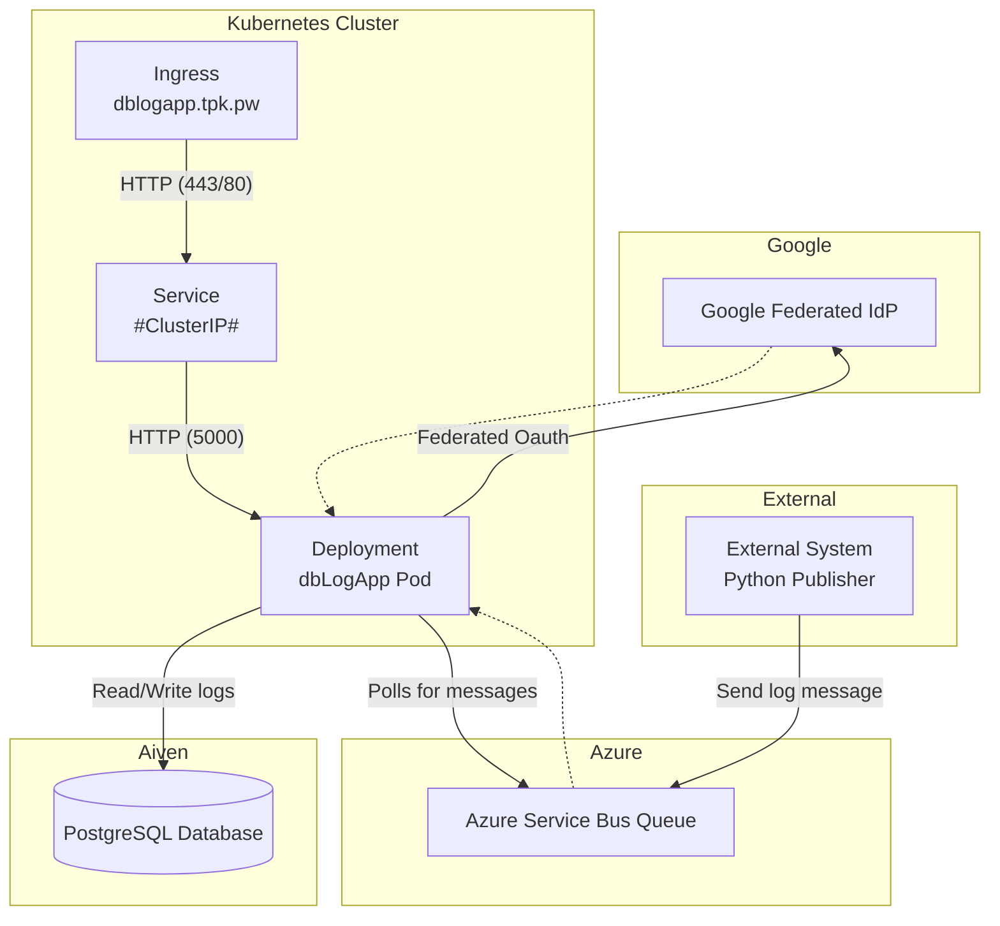

# System Diagram

To better explain this app, let us view a Systems Diagram Overview

Features:

1. External systems publishing to Azure Service Bus Queue using Python.
2. The Kubernetes Ingress routes user traffic to the Service, which routes to the Deployment (Python Flask app).
3. The Deployment (Python Flask app) both polls the Service Bus Queue and reads logs to the external PostgreSQL database in Aiven.

